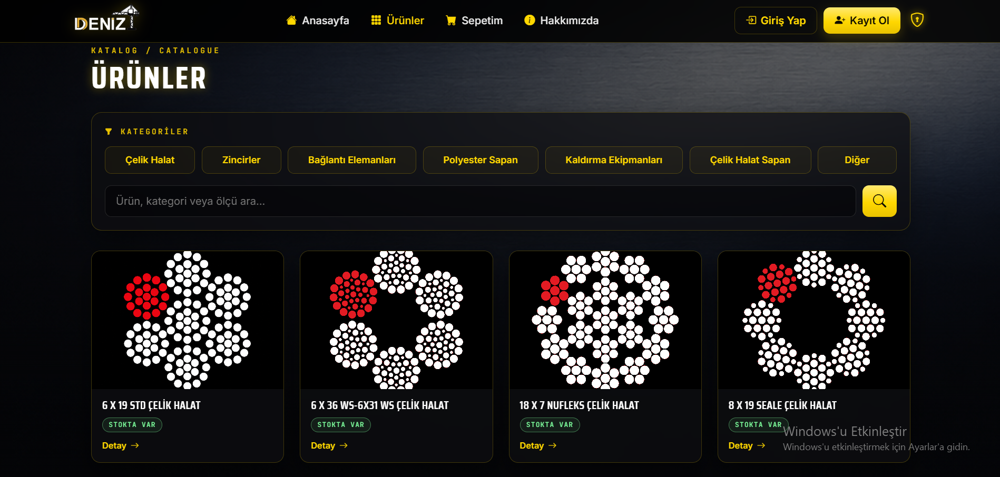
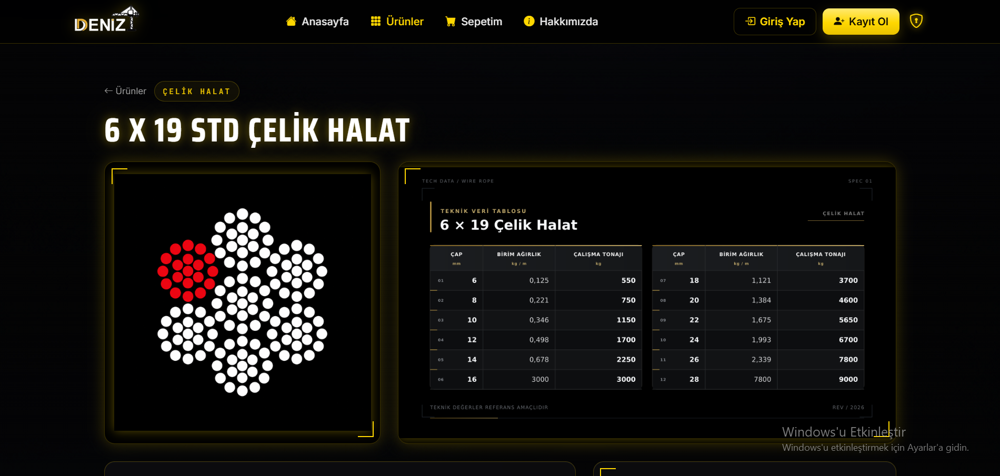
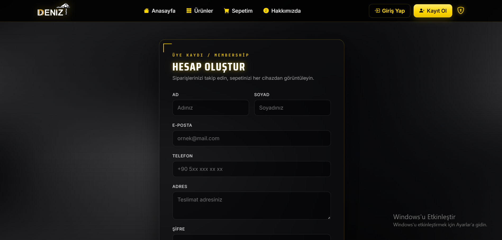

# Deniz Çelik Halat - Industrial Product Catalog System

A professional, dynamic web-based catalog system developed for an industrial steel wire rope and lifting equipment company. This application provides a seamless experience for browsing products, viewing technical specifications, managing orders, and controlling content via a secure admin panel.

## ✨ Features

- **Dynamic Catalog:** Filterable product listings categorized by industry and type.
- **Detailed Specifications:** High-resolution product images alongside technical data table visuals.
- **Advanced Search:** Real-time search functionality covering product names and descriptions.
- **Flexible Pricing System:** Supports fixed-price, custom measurement, preset option, and option-plus-quantity based products.
- **Shopping Cart & Checkout:** Authenticated users can configure products, add them to the cart, and create orders.
- **Order Management:** Users can review their orders while administrators can inspect orders and update order status.
- **Admin Dashboard:** Product management, visibility controls, stock status management, and administrative order tools.
- **Responsive UI:** Elegant Black & Gold theme with Bootstrap and AOS (Animate On Scroll) for a modern user experience.
- **Secure Authentication:** Role-based protected routes using Spring Security.
- **Shipping Weight Support:** Product-specific weight information can be stored for future cargo calculations.

## 📸 Screenshots

| Home Page | Product Listing |
|---|---|
|  |  |

| Product Details & Tech Table | Sign Up Page                    |
|---|---------------------------------|
|  |  |

> Screenshots are stored in the `/screenshots` folder of the repository.

## 🛠️ Tech Stack

- **Backend:** Java 21, Spring Boot 3.5.1
- **Security:** Spring Security
- **Database:** MySQL 8 with Spring Data JPA
- **Frontend:** Thymeleaf, Bootstrap 5, HTML, CSS, JavaScript, AOS Library
- **Build Tool:** Maven
- **Production:** Ubuntu 24.04 LTS, systemd

## 💰 Product Pricing & Measurement System

The catalog contains different types of industrial products, so the application supports multiple pricing models.

### `NONE`

Used for products with a fixed unit price.

```text
Unit Price: 4.410 USD
Quantity: 3
Total: 13.230 USD
```

### `CUSTOM`

Used for products sold according to a custom measurement such as meters.

```text
Price: 12.00 USD / meter
Length: 5 meters
Total: 60.00 USD
```

### `PRESET`

Used for products with predefined selectable variants.

```text
6 mm
8 mm
10 mm
12 mm
```

Each option can have its own price.

### `PRESET_AMOUNT`

Used for products with predefined variants where the customer can also enter a quantity.

```text
Selected Option: 3.15 t
Unit Price: 15.648
Quantity: 4
Total = 15.648 × 4
```

## 🛒 Cart & Checkout

Authenticated users can add configured products to their cart.

Each cart item can preserve:

- Selected product
- Selected measurement or variant
- Measurement amount
- Quantity
- Unit price snapshot

The price snapshot prevents later product price changes from unexpectedly changing an existing cart or order.

The checkout flow converts the active cart into an order and redirects the user to a success page after completion.

> Online payment integration is planned as a future improvement.

## 📦 Order Management

### User Side

Users can:

- View previous orders
- Open order details
- Review purchased products
- See selected variants or measurements
- See quantities and recorded prices

### Admin Side

Administrators can:

- View all orders
- Open detailed order information
- Update order status
- Review ordered products
- Manage products and availability

## 📊 Product Availability

Products use two simple availability controls:

```text
active
inStock
```

- **active:** Controls whether a product is visible to customers.
- **inStock:** Controls whether the product is currently available for purchase.

The application uses a boolean stock state instead of maintaining a numerical inventory count.

## ⚖️ Shipping Weight Support

The application stores shipping-weight information for product-specific cargo calculations.

Supported approaches include:

- Weight per unit
- Kilograms per meter
- Weight assigned to preset product options

For products such as steel wire ropes, weight can vary according to diameter and construction.

```text
6 mm  -> kg/m
8 mm  -> kg/m
10 mm -> kg/m
```

## 🚀 Getting Started

### 📋 System Requirements

- **Java:** JDK 21
- **Database:** MySQL 8.0+
- **Build Tool:** Maven 3.x
- **Version Control:** Git

Check your environment:

```bash
java -version
mvn -version
git --version
```

### Installation

1. **Clone the repository:**

```bash
git clone https://github.com/DenizKaraman461/deniz-celik-halat-katalog.git
cd deniz-celik-halat-katalog
```

2. **Create the database:**

```sql
CREATE DATABASE katalogb;
```

3. **Configure the database connection:**

Update:

```text
src/main/resources/application.properties
```

Example:

```properties
spring.datasource.url=jdbc:mysql://localhost:3306/katalogb
spring.datasource.username=your_username
spring.datasource.password=your_password
```

> Do not commit real database passwords or production credentials to GitHub.

4. **Build the project:**

```bash
mvn clean package -DskipTests
```

5. **Run the application:**

```bash
mvn spring-boot:run
```

or:

```bash
java -jar target/katalog-0.0.1-SNAPSHOT.jar
```

The application runs on:

```text
http://localhost:8080
```

## 🔒 Security

The application uses Spring Security with role-based authorization.

Current roles:

```text
USER
ADMIN
```

Important protected routes include:

```text
/admin/**
/cart/**
/checkout/**
```

CSRF protection remains enabled for state-changing requests.

Production passwords, SSH keys, database credentials, and other secrets should never be committed to the repository.

## 🌐 Production Deployment

The application is packaged as an executable Spring Boot JAR and deployed to an Ubuntu server.

Production JAR path:

```text
/home/deniz/katalog-run/katalog.jar
```

The application is managed with:

```text
katalog.service
```

### Build

```bash
mvn clean package -DskipTests
```

### Upload

```bash
scp target/katalog-0.0.1-SNAPSHOT.jar <user>@<server>:/home/deniz/katalog-run/katalog.jar
```

### Restart

```bash
sudo systemctl restart katalog.service
```

### Check Status

```bash
sudo systemctl status katalog.service --no-pager
```

### View Logs

```bash
journalctl -u katalog.service -f
```

## ✅ Deployment Checklist

Before deploying a new version:

1. Review changed files.
2. Make sure no credentials or private keys are included.
3. Build the project locally.
4. Confirm `BUILD SUCCESS`.
5. Upload the new JAR.
6. Restart `katalog.service`.
7. Confirm the service is running.
8. Test the live website.

Recommended checks:

```text
Home page
Product listing
Search
Product details
Login
Cart
Checkout
User orders
Admin panel
Admin orders
Product editing
Stock status
Product visibility
```

## 🔮 Future Improvements

- Online payment integration
- Automated cargo pricing
- Improved shipping rules
- Automated database migrations
- Automated tests
- CI/CD deployment
- Improved admin reporting
- Monitoring and structured production logging

## 📄 License

This project is developed for **Kadir Karaman Deniz Çelik Halat**.  
All rights reserved.

## 👤 Author

**Deniz Karaman**

- GitHub: [@DenizKaraman461](https://github.com/DenizKaraman461)
- LinkedIn: [Deniz Karaman](https://www.linkedin.com/in/deniz-karaman-4450a2352/)
- University: İzmir University of Economics - Computer Engineering
